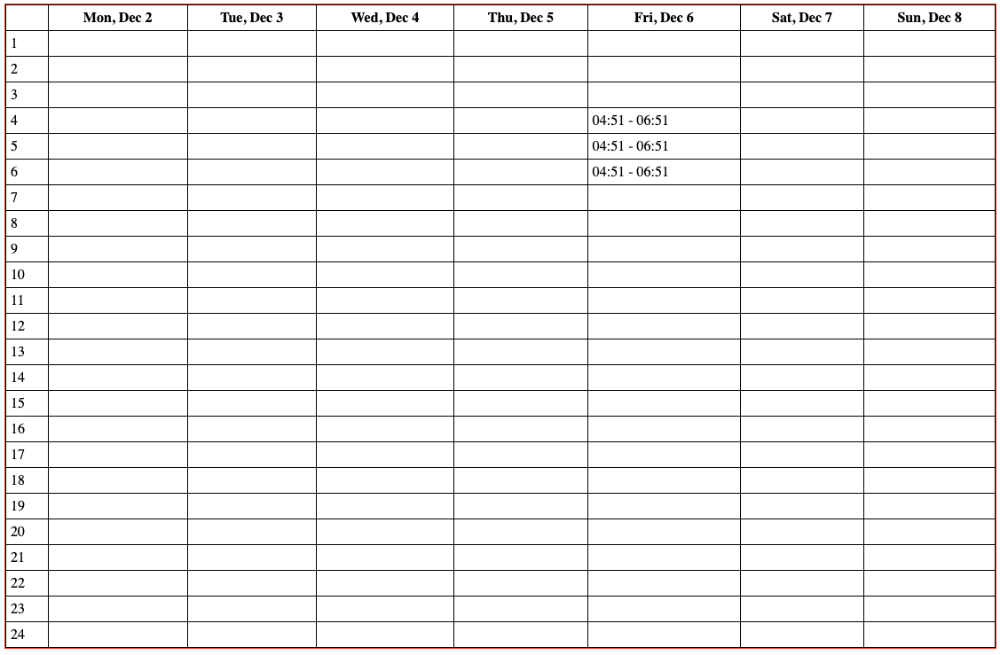

# Libra
Essential Components for SaaS Makers — Focus on Your Product, Not the Boilerplate

There are already plenty of amazing solutions on the market, but many of them fall short when it comes to developer experience (DX). The goal of [Nom du Projet] is to provide a set of practical, developer-friendly components tailored for SaaS creators.

By streamlining common tasks like calendars, lists, and tables, [Nom du Projet] allows you to focus on what truly matters: building and refining your product, rather than reinventing the wheel.

## Why ?
Built for SaaS makers: Components designed to solve real-world SaaS challenges.
DX-first: Intuitive APIs and seamless integration.
Modular: Use only what you need, with no unnecessary overhead.
Time-saving: Spend less time on repetitive tasks and more on innovation.

## Calendar

